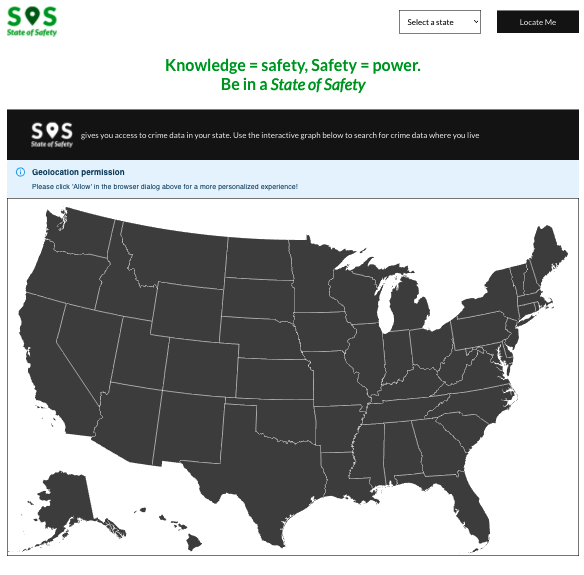
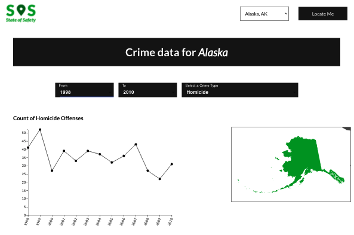
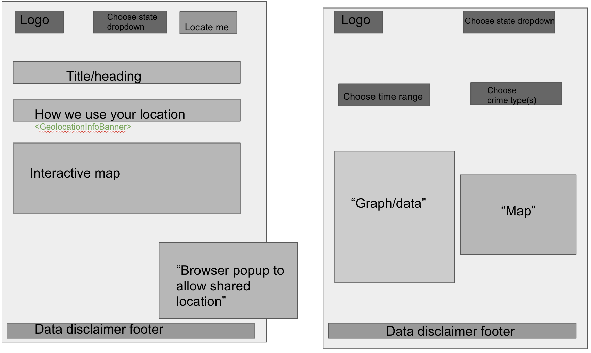
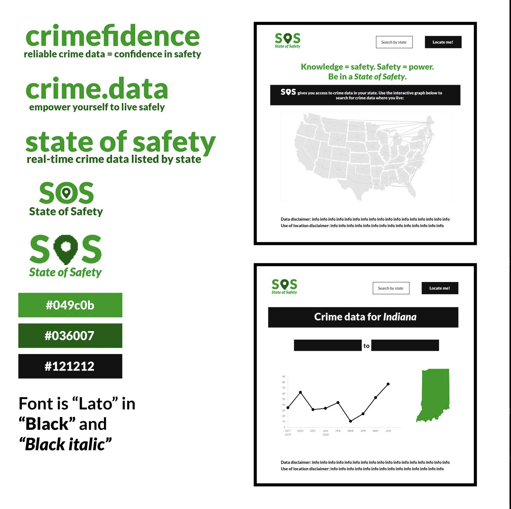

# State of Safety (SOS) 

> Knowledge = safety, Safety = power. Be in a State of Safety. [SOS](https://state-of-safety.herokuapp.com/) gives you access to the crime data in your state.

<table>
  <tr>
      <td vlign="center">
        
      </td>
      <td vlign="center">
        
      </td>
    </tr>
</table>

# Wireframes
<table>
  <tr>
      <td vlign="center">
        
      </td>
      <td vlign="center">
        
      </td>
    </tr>
</table>

# User Stories for MVP
- Select the state from the dropdown list of states
- Select the specific state on the interactive map
- Click on "Locate Me" to be automatically located
- Be able to filter through various crime criteria (year range and crime type) to learn more about specific crimes that are of direct concern
- A line chart to show the crime data for selected crime type
- See the current selected state on the map by area

# Dependencies
React, Material UI, D3, Axios

# API
- [FBI Crime Data API](https://crime-data-explorer.fr.cloud.gov/api)
- [Mapbox](https://www.mapbox.com/)

# Installation
Clone the repository to your local machine:

```
git clone https://github.com/chingu-voyages/v26-geckos-team-02.git
```

Cd into the new directory:

```
cd v26-geckos-team-02
```

Install dependencies:

```
npm i
```

Create a .env file with a FBI Crime Data API key and Mapbox access token (see .env.sample file)

Start the app locally:

```
npm start
```
# Authors
Product Owner: [David](), Developers: [Dario](https://github.com/theborgh), [Jennifer](https://github.com/spicysos), [Nhi](https://github.com/nhi-ngo)

State of Safety App | Voyage-26 | https://chingu.io/ | Twitter: https://twitter.com/ChinguCollabs | Heroku: https://state-of-safety.herokuapp.com/
